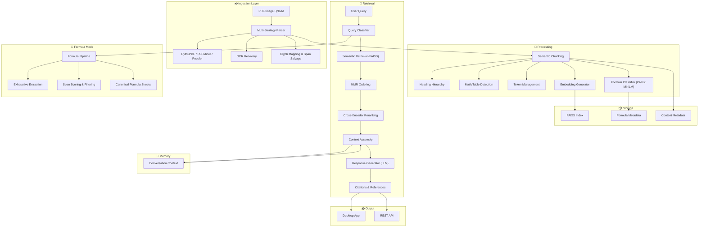

# Anagnosis  

**AI-powered document intelligence for university students and researchers**  

Anagnosis is a project designed to help students, researchers, and academics work more effectively with complex documents. Instead of skimming hundreds of pages or losing track of formulas buried in PDFs, Anagnosis transforms unstructured academic files into searchable, citation-ready knowledge.  

Built on top of a custom **retrieval-augmented generation (RAG)** pipeline, it integrates **multi-strategy document parsing, AI-driven formula recognition, semantic retrieval, and conversation memory** into a single workflow. The goal is simple: reduce time wasted searching and increase time spent understanding.  

> ⚠️ **Status:** Work in Progress — this is not a finished tool. It’s an experimental project that also serves as a demonstration of applied skills in RAG, LLM orchestration, reranking, ONNX deployment, and system design.  

---

## Project Objectives  

- Make dense academic PDFs easier to navigate.  
- Provide **citation-ready answers** backed by page references.  
- Build automatic **formula sheets** by extracting mathematical content.  
- Enable **semantic search** across lecture notes, research papers, and textbooks.  
- Create a **persistent conversation layer** so follow-up questions keep context.  
- Deliver knowledge through both a **desktop GUI** and an **API server**.  

---

## Key Features  

- **Document Parsing**: PyMuPDF, PDFMiner, Poppler, and OCR fallback with glyph recovery.  
- **Formula Intelligence**: ONNX-based MiniLM classifier, formula mode, canonical LaTeX export.  
- **Semantic Retrieval**: FAISS embeddings, MMR ordering, SFT reranking, cross-encoder integration.  
- **Chunking & Embeddings**: Structure-preserving segmentation, math/table detection, token overlap control.  
- **Conversation Memory**: Persistent history with intelligent pruning.  
- **APIs & Interfaces**: REST endpoints (FastAPI) and PySide6 GUI.  

---

## System Overview  

---

## Tech Stack  

- **RAG pipeline** with FAISS + MMR + cross-encoder reranking  
- **LLMs**: OpenAI GPT, HuggingFace backends, vLLM server support  
- **SFT reranking**: Supervised fine-tuned relevance models  
- **Formula classification**: ONNX Runtime (MiniLM custom model)  
- **OCR**: Tesseract-based fallback with math-aware configs  
- **Embeddings**: HuggingFace SentenceTransformers  
- **Interfaces**: FastAPI REST API + PySide6 GUI  

---

## Current Status  

- Document parsing pipeline in place with OCR fallbacks  
- Formula detection and classification working with ONNX model  
- Semantic retrieval with FAISS index + reranking enabled  
- Basic GUI and REST API functional  
- Citation-ready outputs available  
- Conversation memory system integrated  

---

## Why This Matters  

University students and researchers often face the same problem: too much material, too little time. Traditional search is keyword-based and fails on PDFs filled with equations, tables, and diagrams. Anagnosis shows how modern **AI, embeddings, and retrieval techniques** can be used to bridge that gap — surfacing formulas, definitions, and explanations directly when needed.  

This project is both a **practical tool-in-progress** for academic life and a **demonstration of technical skills** in advanced AI system design.  
