# Anagnosis

**Document intelligence system using retrieval-augmented generation for academic research and knowledge synthesis.**

> **⚠️ Work in Progress**: This software is currently under development. It will be packaged as a standalone application. Current functionality requires manual setup and may differ from the final product.

---

## Overview

Anagnosis uses **retrieval-augmented generation (RAG)** to transform academic materials into a queryable knowledge base. Instead of searching individual files, it creates a **personal dataset** that understands relationships between concepts across your entire document collection.

**Key Difference**: Traditional tools work with isolated documents. Anagnosis builds a **unified knowledge graph** where information from multiple sources can be synthesized to answer complex questions with precise citations.

### RAG Pipeline

1. **Document Ingestion** → Parse PDFs, images, text files
2. **Semantic Chunking** → Break into contextually meaningful segments  
3. **Vector Embedding** → Generate dense representations of content
4. **Knowledge Indexing** → Store in searchable vector database
5. **Query Processing** → Retrieve relevant chunks via semantic similarity
6. **Context Assembly** → Combine passages with conversation history
7. **Response Generation** → LLM synthesizes grounded answers

**Result**: Every response includes **exact page references** and **source citations** from your personal collection.

---

## System Architecture

```mermaid
flowchart LR
    subgraph Input [" "]
        direction TB
        A[Course Readings<br/>PDFs, Papers]
        B[Lecture Materials<br/>Slides, Notes]  
        C[Research Sources<br/>Articles, Books]
        D[Personal Documents<br/>Essays, Reports]
    end
    
    subgraph Process [" "]
        direction TB
        E[Document Parser<br/>Text + OCR]
        F[Semantic Chunker<br/>Context Segmentation]
        G[Vector Embedder<br/>Dense Representations]
        H[Knowledge Indexer<br/>FAISS Vector Store]
        
        E --> F
        F --> G
        G --> H
    end
    
    subgraph Storage [" "]
        direction TB
        I[Vector Index<br/>Semantic Search]
        J[Citation Database<br/>Source Tracking]
        K[Context Memory<br/>Query History]
        L[Document Metadata<br/>Cross-References]
    end
    
    subgraph Query [" "]
        direction TB
        M[Semantic Retrieval<br/>Similarity Search]
        N[Context Assembly<br/>Relevant Passages]
        O[Response Generation<br/>LLM Synthesis]
        P[Citation Extraction<br/>Source Attribution]
        
        M --> N
        N --> O
        O --> P
    end
    
    subgraph Output [" "]
        direction TB
        Q[Desktop Application<br/>Interactive GUI]
        R[REST API<br/>Programmatic Access]
        S[Structured Output<br/>Citations + Evidence]
    end
    
    Input -.-> Process
    Process -.-> Storage
    Storage -.-> Query
    Query -.-> Output
    
    classDef inputStyle fill:#e3f2fd,stroke:#1976d2,stroke-width:2px,color:#000
    classDef processStyle fill:#fff3e0,stroke:#f57c00,stroke-width:2px,color:#000
    classDef storageStyle fill:#f3e5f5,stroke:#7b1fa2,stroke-width:2px,color:#000
    classDef queryStyle fill:#e8f5e8,stroke:#388e3c,stroke-width:2px,color:#000
    classDef outputStyle fill:#fce4ec,stroke:#c2185b,stroke-width:2px,color:#000
    
    class A,B,C,D inputStyle
    class E,F,G,H processStyle
    class I,J,K,L storageStyle
    class M,N,O,P queryStyle
    class Q,R,S outputStyle
```



## Key Capabilities

### Personal Dataset Creation
- Transform documents into **structured, searchable knowledge base**
- RAG pipeline extracts **semantic meaning** and establishes connections
- **Source attribution** maintained throughout processing
- Every piece of information **traceable to original context**

### Cross-Document Knowledge Synthesis
- Query concepts **spanning multiple sources** simultaneously
- RAG retrieves passages from **entire collection**
- Synthesize insights from **different courses, authors, time periods**
- **Cross-document understanding** distinguishes RAG from traditional search

### Context-Aware Response Generation
- **Conversation history** informs current responses
- Enable **follow-up questions** and deeper exploration
- RAG pipeline keeps responses **grounded in your documents**
- **Contextually relevant** answers based on previous queries

### Automatic Source Attribution
- **Precise citations** with page numbers and source documents
- RAG retrieval tracks **origin of each piece of information**
- **Automatic bibliography generation** and fact verification
- **Exact page references** for academic integrity

---

## RAG Implementation Details

### Vector Embedding Models
- **HuggingFace**: `intfloat/e5-small-v2` for local embedding generation
- **OpenAI**: `text-embedding-3-small` for cloud-based embeddings
- **Custom Models**: Support for sentence-transformers and other embedding backends

### Retrieval System
- **FAISS Vector Index**: Efficient similarity search across document embeddings
- **Semantic Chunking**: Context-aware text segmentation with configurable overlap
- **Metadata Preservation**: Source tracking and citation information maintained throughout pipeline
- **Reranking**: Optional reranking models to improve retrieval quality

### Generation Pipeline
- **Context Assembly**: Intelligent selection of relevant passages for LLM input
- **Conversation Memory**: Integration of query history for contextual responses
- **Source Grounding**: Responses constrained to information present in retrieved documents
- **Citation Generation**: Automatic extraction of supporting quotes with page references

---

## Use Cases

### Academic Research
- Build **comprehensive knowledge base** from research papers and course readings
- Query broad topics like **"theories of social capital"**
- Receive **synthesized responses** from economics, sociology, political science sources
- **Full citations** included automatically

### Literature Review
- **Natural language queries** instead of manual document scanning
- Identify **key themes, methodologies, findings** across source collection
- RAG system finds **connections between papers** that aren't immediately obvious
- **Cross-document insights** emerge from semantic search

### Study Material Generation
- Create **study guides** connecting concepts across different courses
- Ask **"How do behavioral economics principles apply to public policy?"**
- Receive answers that **synthesize insights from multiple disciplines**
- **Exam preparation materials** with cross-course connections

### Citation and Bibliography Management
- **Automatically generate citations** and bibliographies from queries
- System **tracks all sources** used in responses
- **Easy compilation** of reference lists for papers and assignments
- **Academic integrity** maintained with precise source attribution

---

## Installation and Setup

### Prerequisites

**System Requirements:**
- Python 3.8 or higher
- Tesseract OCR engine

**Install Tesseract:**
```bash
# macOS
brew install tesseract

# Ubuntu/Debian
sudo apt-get install tesseract-ocr

# Windows
# Download from: https://github.com/UB-Mannheim/tesseract/wiki
```

### Installation Steps

1. **Clone Repository:**
   ```bash
   git clone https://github.com/Duncanyu/anagnosis.git
   cd anagnosis
   ```

2. **Install Dependencies:**
   ```bash
   pip install fastapi uvicorn pyside6 pymupdf pillow pytesseract faiss-cpu numpy openai transformers torch sentence-transformers markdown
   ```

3. **Configure Environment:**
   ```bash
   cp .env.example .env
   # Edit .env with your API keys and preferences
   ```

4. **Run Application:**
   ```bash
   # Desktop Interface
   python app/app_qt.py
   
   # API Server
   uvicorn api.main:app --reload --host 0.0.0.0 --port 8000
   ```

---

## Usage Examples

### Building Your Knowledge Base

Upload documents through the desktop interface or API. The RAG pipeline automatically:
- Extracts text using OCR when necessary
- Segments content into semantic chunks
- Generates vector embeddings
- Builds searchable index with source tracking

### Querying Your Personal Dataset

```
Query: "How do behavioral economics insights relate to public policy design?"

RAG Process:
1. Query embedding generated
2. Semantic search across vector index
3. Relevant chunks retrieved from multiple sources
4. Context assembled with conversation history
5. LLM generates response grounded in retrieved content

Response: "Behavioral economics provides several key insights for public policy design, particularly around choice architecture and nudging...

From your Economics 301 readings:
- Thaler & Sunstein emphasize how default options significantly influence behavior [Nudge.pdf p.83]
- Kahneman's prospect theory shows people are loss-averse in decision-making [Thinking_Fast_Slow.pdf p.279]

From your Public Policy 205 materials:
- Implementation challenges often stem from cognitive biases [Policy_Implementation.pdf p.45]
- Successful programs account for bounded rationality [Case_Studies.pdf p.112]

Citations: [Nudge.pdf p.83], [Thinking_Fast_Slow.pdf p.279], [Policy_Implementation.pdf p.45], [Case_Studies.pdf p.112]
```

### API Integration

```bash
# Upload document to RAG system
curl -X POST "http://localhost:8000/upload/" \
     -H "Content-Type: multipart/form-data" \
     -F "file=@research_paper.pdf"

# Query personal knowledge base
curl -X POST "http://localhost:8000/query/" \
     -H "Content-Type: application/json" \
     -d '{"question": "What are the main theories of social capital?", "k": 8}'
```

---

## Technical Implementation

### Project Structure

```
anagnosis/
├── app/
│   └── app_qt.py              # Desktop application interface
├── api/
│   ├── main.py                # FastAPI server entry point
│   ├── routes/
│   │   ├── upload.py          # Document upload for RAG pipeline
│   │   ├── query.py           # RAG query processing
│   │   └── secrets.py         # API key management
│   └── services/
│       ├── parse.py           # Document parsing and OCR
│       ├── chunk.py           # Semantic text chunking
│       ├── embed.py           # Vector embedding generation
│       ├── index.py           # FAISS vector indexing
│       ├── summarize.py       # RAG-based response generation
│       ├── memory.py          # Conversation context management
│       └── aliases.py         # Terminology management
└── artifacts/                 # RAG knowledge base storage
    ├── index.faiss           # Vector search index
    ├── meta.json             # Document metadata
    ├── chunks.jsonl          # Text segments with embeddings
    ├── memory.jsonl          # Query history for context
    └── doc_summaries.jsonl   # Document summaries
```

### RAG Configuration

```env
# Embedding Backend for Vector Generation
EMBED_BACKEND=hf              # hf (HuggingFace) | openai
LLM_BACKEND=openai            # openai | vllm for response generation
RERANK_BACKEND=hf             # hf | cohere | none for retrieval reranking

# RAG Memory Management
MEMORY_ENABLED=true           # Enable conversation context in RAG
MEMORY_TOKEN_LIMIT=1200       # Context window for RAG responses
MEMORY_FILE_LIMIT_MB=50       # Storage limit for conversation history

# API Configuration
OPENAI_API_KEY=your_key_here
HF_TOKEN=your_hf_token
COHERE_API_KEY=your_cohere_key
```

### RAG Pipeline Components

| Component | Purpose | Implementation |
|-----------|---------|----------------|
| **Document Parser** | Extract text from various formats | PyMuPDF + Tesseract OCR |
| **Semantic Chunker** | Create meaningful text segments | Context-aware splitting with overlap |
| **Vector Embedder** | Generate semantic representations | HuggingFace or OpenAI embeddings |
| **Vector Index** | Enable fast similarity search | FAISS with metadata preservation |
| **Retrieval System** | Find relevant document chunks | Semantic search with optional reranking |
| **Context Assembler** | Combine retrieved passages | Multi-source context with conversation history |
| **Response Generator** | Synthesize grounded answers | GPT-4 or local LLM with retrieved context |

---

## Advanced Configuration

### Custom RAG Models

```env
# Local LLM for response generation
LLM_BACKEND=vllm
LLM_OPENAI_BASE=http://localhost:8001/v1

# Custom embedding model for vector generation
EMBED_MODEL=sentence-transformers/all-MiniLM-L6-v2
```

### RAG Performance Tuning

```env
# Large document collections
MEMORY_TOKEN_LIMIT=2000       # Larger context window
MEMORY_FILE_LIMIT_MB=100      # More conversation history

# Resource-constrained environments
MEMORY_TOKEN_LIMIT=800        # Smaller context window
MEMORY_FILE_LIMIT_MB=25       # Limited conversation history
```

### Python RAG Client

```python
import requests

class AnagnosisRAGClient:
    def __init__(self, base_url="http://localhost:8000"):
        self.base_url = base_url
    
    def add_to_knowledge_base(self, file_path):
        """Add document to RAG system"""
        with open(file_path, "rb") as f:
            response = requests.post(
                f"{self.base_url}/upload/",
                files={"file": f}
            )
        return response.json()
    
    def query_rag_system(self, question, k=5):
        """Query personal knowledge base using RAG"""
        response = requests.post(
            f"{self.base_url}/query/",
            json={"question": question, "k": k}
        )
        return response.json()
    
    def generate_bibliography(self, topic):
        """Generate bibliography from RAG responses"""
        result = self.query_rag_system(f"Sources related to {topic}")
        return result.get("citations", [])
```

---

## Development Status

**Current State**: Functional RAG implementation with core capabilities

**RAG Features Implemented:**
- Document ingestion and vector embedding generation
- FAISS-based semantic search and retrieval
- Context-aware response generation with source attribution
- Conversation memory integration
- Multiple embedding and LLM backend support

**Known Limitations:**
- Manual installation and configuration required
- Local deployment only
- Performance scales with document collection size

**Planned RAG Enhancements:**
- Advanced retrieval strategies (hybrid search, query expansion)
- Improved chunk boundary detection
- Enhanced cross-document relationship modeling
- Collaborative knowledge base features

---

## Contributing

Contributions are welcome, particularly in areas of:
- RAG pipeline optimization and retrieval strategies
- Vector embedding and similarity search improvements
- Context assembly and response generation enhancements
- Cross-document relationship detection

Please ensure:
- Code follows existing RAG architecture patterns
- New features include appropriate tests
- Documentation reflects RAG implementation details
- Backward compatibility is maintained

---

## License

This project is released under the MIT License. See LICENSE file for details.

---

## Support

- **Issues**: Report bugs and feature requests via GitHub Issues
- **Documentation**: Refer to code comments and RAG implementation examples
- **API Reference**: Available at `/docs` when running the FastAPI server
