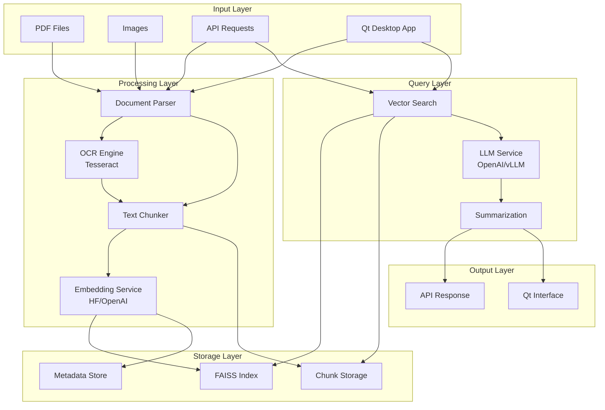

# Reading Agent

A document processing and question-answering system that combines a FastAPI backend with a Qt desktop application. The system can ingest PDF documents and images, process them using OCR when needed, create embeddings, and answer questions about the content using RAG (Retrieval-Augmented Generation).

## Features

- **Document Processing**: Support for PDF files and images (PNG, JPG, JPEG, TIF, TIFF, BMP, WEBP)
- **OCR Integration**: Automatic OCR for scanned documents and images using Tesseract
- **Vector Search**: FAISS-based similarity search with configurable embedding backends
- **Question Answering**: RAG-based Q&A using OpenAI or local LLM backends
- **Dual Interface**: Both REST API and Qt desktop application
- **Flexible Backends**: Support for multiple embedding and LLM providers

## Architecture



## Project Structure

```
reading-agent/
├── api/                    # FastAPI backend
│   ├── main.py            # FastAPI application entry point
│   ├── core/
│   │   └── config.py      # Configuration management
│   ├── routes/
│   │   ├── upload.py      # Document upload endpoints
│   │   ├── query.py       # Query endpoints
│   │   └── secrets.py     # API key management
│   └── services/
│       ├── parse.py       # Document parsing (PDF/images)
│       ├── chunk.py       # Text chunking
│       ├── embed.py       # Text embedding
│       ├── index.py       # Vector indexing with FAISS
│       └── summarize.py   # LLM-based summarization
├── app/
│   └── app_qt.py         # Qt desktop application
├── artifacts/            # Generated files (index, chunks, metadata)
└── .env.example         # Environment configuration template
```

## Prerequisites

### System Dependencies

- **Python 3.8+**
- **Tesseract OCR**: Required for OCR functionality
  - macOS: `brew install tesseract`
  - Ubuntu/Debian: `sudo apt-get install tesseract-ocr`
  - Windows: Download from [GitHub releases](https://github.com/UB-Mannheim/tesseract/wiki)

### Optional Dependencies

- **Qdrant**: Vector database (if using instead of FAISS)
- **Local LLM Server**: For vLLM backend (e.g., running on `localhost:8001`)

## Installation

1. **Clone the repository**:
   ```bash
   git clone https://github.com/Duncanyu/reading-agent.git
   cd reading-agent
   ```

2. **Install Python dependencies**:
   ```bash
   pip install fastapi uvicorn pyside6 pymupdf pillow pytesseract faiss-cpu numpy openai transformers torch sentence-transformers markdown
   ```

3. **Set up environment variables**:
   ```bash
   cp .env.example .env
   ```
   
   Edit `.env` with your configuration:
   ```env
   # Backend selection
   EMBED_BACKEND=hf           # hf|openai
   LLM_BACKEND=openai         # vllm|openai
   RERANK_BACKEND=hf          # hf|cohere|none
   
   # API endpoints
   QDRANT_URL=http://localhost:6333
   LLM_OPENAI_BASE=http://localhost:8001/v1
   
   # API Keys
   OPENAI_API_KEY=your_openai_key_here
   HF_TOKEN=your_huggingface_token_here
   COHERE_API_KEY=your_cohere_key_here
   ```

## Usage

### Option 1: Qt Desktop Application

Run the desktop application:
```bash
python app/app_qt.py
```

**Features:**
- **Settings**: Configure API keys and backend preferences
- **Ingest Tab**: Upload and process documents (PDF/images)
- **Ask Tab**: Query your documents with natural language

**Workflow:**
1. Open Settings and configure your API keys
2. Go to Ingest tab, choose files, and click "Ingest"
3. Switch to Ask tab and ask questions about your documents

### Option 2: REST API

Start the FastAPI server:
```bash
uvicorn api.main:app --reload --host 0.0.0.0 --port 8000
```

**API Endpoints:**

- **Upload Document**: `POST /upload/`
  ```bash
  curl -X POST "http://localhost:8000/upload/" \
       -H "Content-Type: multipart/form-data" \
       -F "file=@document.pdf"
  ```

- **Query Documents**: `POST /query/`
  ```bash
  curl -X POST "http://localhost:8000/query/" \
       -H "Content-Type: application/json" \
       -d '{"question": "What is the main topic?", "k": 5}'
  ```

- **API Documentation**: Visit `http://localhost:8000/docs`

## Configuration Options

### Embedding Backends

- **HuggingFace (`hf`)**: Uses `intfloat/e5-small-v2` model (default)
- **OpenAI (`openai`)**: Uses `text-embedding-3-small` model

### LLM Backends

- **OpenAI (`openai`)**: Uses OpenAI's GPT models (default)
- **vLLM (`vllm`)**: Uses local vLLM server for inference

### Reranking Backends

- **HuggingFace (`hf`)**: Local reranking model
- **Cohere (`cohere`)**: Cohere's reranking API
- **None (`none`)**: No reranking

## Data Flow

1. **Document Ingestion**:
   - Parse PDF/images using PyMuPDF and PIL
   - Apply OCR with Tesseract for scanned content
   - Split text into semantic chunks
   - Generate embeddings using selected backend
   - Store in FAISS index with metadata

2. **Query Processing**:
   - Embed user question
   - Search FAISS index for similar chunks
   - Retrieve top-k relevant passages
   - Generate answer using LLM with context
   - Return answer with citations

## Storage

- **FAISS Index**: `artifacts/index.faiss`
- **Metadata**: `artifacts/meta.json`
- **Chunks**: `artifacts/chunks.jsonl`

## Troubleshooting

### Common Issues

1. **Tesseract not found**:
   - Ensure Tesseract is installed and in PATH
   - On Windows, you may need to set `TESSDATA_PREFIX`

2. **FAISS installation issues**:
   - Use `faiss-cpu` for CPU-only systems
   - Use `faiss-gpu` if you have CUDA support

3. **Memory issues with large documents**:
   - Adjust chunk size in `api/services/chunk.py`
   - Consider using Qdrant instead of FAISS for large datasets

4. **API key errors**:
   - Verify API keys in `.env` file
   - Check that the correct backend is selected

### Performance Tips

- Use GPU-accelerated embeddings when available
- Adjust `k` parameter in queries for speed vs. accuracy trade-off
- Consider using reranking for better result quality
- Use local LLM backends to reduce API costs

## Development

To contribute to the project:

1. Fork the repository
2. Create a feature branch
3. Make your changes
4. Test with both Qt app and API
5. Submit a pull request

## License

This project is open source. Please check the repository for license details.
