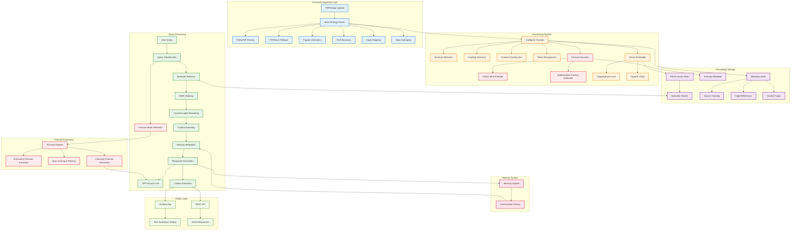

# Anagnosis

**Advanced document intelligence system using retrieval-augmented generation for academic research and knowledge synthesis.**

> **⚠️ Work in Progress**: This software is currently under development. It will be packaged as a standalone application. Current functionality requires manual setup and may differ from the final product.

---

## What Makes Anagnosis Different

### **Intelligent Document Processing**
Unlike basic PDF readers, Anagnosis uses **multi-layered text extraction** with automatic fallback strategies:
- **Primary**: PyMuPDF for fast, accurate text extraction
- **Fallback**: PDFMiner and Poppler for problematic documents
- **OCR Recovery**: Tesseract OCR for scanned pages and corrupted text
- **Glyph Mapping**: Custom font maps to decode private Unicode areas
- **Span Salvaging**: Targeted OCR on suspicious text regions

### **Advanced Formula Recognition & Processing**
Revolutionary **AI-powered formula classification** system:
- **ONNX-based Formula Classifier**: Custom-trained MiniLM model for precise formula detection
- **Formula Mode**: Specialized query processing for mathematical content
- **Smart Formula Extraction**: Identifies equations, identities, theorems, and mathematical rules
- **Context-Aware Filtering**: Distinguishes formulas from exercises and examples
- **Reranking Integration**: Advanced relevance scoring for mathematical content

### **Context-Aware Knowledge Synthesis**
Traditional tools search individual documents. Anagnosis builds a **unified knowledge graph**:
- **Cross-Document Understanding**: Synthesize insights from multiple sources simultaneously
- **Semantic Chunking**: Preserve document structure and context boundaries
- **Conversation Memory**: Maintain context across queries for deeper exploration
- **Source Attribution**: Every response includes exact page references and citations

### **Advanced Retrieval Pipeline**
Beyond simple keyword matching:
- **Semantic Search**: Vector embeddings capture meaning, not just words
- **Content-Type Detection**: Identifies math, tables, and structured content
- **Heading Hierarchy**: Preserves document structure in chunks
- **Multi-Modal Processing**: Handles PDFs, images, and mixed content types
- **MMR Ordering**: Maximal Marginal Relevance for diverse result selection
- **Cross-Encoder Reranking**: Multiple reranking models (MiniLM, BGE-M3, BGE-Base, BGE-Large)

### **Conversational Intelligence**
- **Follow-up Questions**: Build on previous queries naturally
- **Context Preservation**: Remember what you've discussed
- **Academic Integrity**: Automatic citation generation with page numbers
- **Evidence Snippets**: Direct quotes supporting each claim
- **Batch Processing**: Intelligent context assembly for comprehensive answers

---

## System Architecture



## Core Features

### **Revolutionary Formula Processing**
- **AI-Powered Classification**: Custom ONNX MiniLM model trained specifically for formula detection
- **Formula Mode**: Specialized processing pipeline for mathematical queries
- **Smart Extraction**: Identifies equations, identities, theorems, and mathematical rules
- **Context Filtering**: Distinguishes formulas from exercises, examples, and problem statements
- **Span Scoring**: Advanced confidence scoring for mathematical content
- **Canonical Generation**: Produces clean, organized formula sheets from extracted content

### **Robust Document Processing**
- **Multi-Format Support**: PDFs, images (PNG, JPG, TIFF, WebP, BMP)
- **OCR Integration**: Automatic text recognition for scanned documents
- **Error Recovery**: Multiple extraction strategies for problematic files
- **Quality Detection**: Identifies and flags suspicious or low-quality text
- **Font Decoding**: Custom glyph mapping for specialized fonts

### **Intelligent Chunking**
- **Structure Preservation**: Maintains headings, lists, and document hierarchy
- **Content-Aware Splitting**: Recognizes math, tables, and formatted content
- **Overlap Management**: Smart token overlap for context continuity
- **Reading Order**: Handles multi-column layouts and complex page structures
- **Header/Footer Removal**: Automatically filters repetitive page elements

### **Advanced Retrieval**
- **Semantic Similarity**: Vector-based search beyond keyword matching
- **Content Classification**: Separate handling for math, tables, and text
- **MMR Ordering**: Maximal Marginal Relevance for diverse results
- **Cross-Encoder Reranking**: Multiple reranking models for relevance optimization
- **Metadata Filtering**: Search by document type, page range, or content features
- **Hybrid Search**: Combines semantic and lexical matching strategies

### **Persistent Memory**
- **Conversation Context**: Maintains discussion history across sessions
- **Token Management**: Intelligent context window optimization
- **Memory Pruning**: Automatic cleanup to manage storage limits
- **Context Assembly**: Integrates relevant history with current queries

---

## Use Cases

### 📖 **Academic Research**
Transform your research workflow:
```
Query: "What are the key trigonometric identities for calculus?"

Formula Mode Response:
## Trigonometric Identities

### Basic Identities
- `sin²(x) + cos²(x) = 1` — Pythagorean identity [Calculus.pdf p.45]
- `tan(x) = sin(x)/cos(x)` — Tangent definition [Calculus.pdf p.45]
- `sec²(x) = 1 + tan²(x)` — Secant identity [Calculus.pdf p.46]

### Double-Angle Formulas
- `sin(2x) = 2sin(x)cos(x)` — Double-angle sine [Calculus.pdf p.78]
- `cos(2x) = cos²(x) - sin²(x)` — Double-angle cosine [Calculus.pdf p.78]
- `cos(2x) = 2cos²(x) - 1` — Alternative form [Calculus.pdf p.78]

### Integration Formulas
- `∫sin(x)dx = -cos(x) + C` — Sine integral [Calculus.pdf p.156]
- `∫cos(x)dx = sin(x) + C` — Cosine integral [Calculus.pdf p.156]
- `∫sec²(x)dx = tan(x) + C` — Secant squared integral [Calculus.pdf p.157]

Citations: [Calculus.pdf p.45], [Calculus.pdf p.46], [Calculus.pdf p.78], [Calculus.pdf p.156], [Calculus.pdf p.157]
```

### 📝 **Literature Reviews**
Accelerate systematic analysis:
- **Theme Identification**: Find common patterns across papers
- **Methodology Comparison**: Compare research approaches and findings
- **Gap Analysis**: Identify underexplored areas in your field
- **Citation Networks**: Trace how ideas develop across publications

### 🎓 **Study Materials**
Create comprehensive study resources:
- **Cross-Course Synthesis**: Connect concepts from different classes
- **Formula Sheets**: Generate organized mathematical reference materials
- **Concept Mapping**: Understand relationships between ideas
- **Bibliography Generation**: Automatic reference compilation

---

## Installation and Setup

### Prerequisites

**System Requirements:**
- Python 3.8 or higher
- Tesseract OCR engine

**Install Tesseract:**
```bash
# macOS
brew install tesseract

# Ubuntu/Debian
sudo apt-get install tesseract-ocr

# Windows
# Download from: https://github.com/UB-Mannheim/tesseract/wiki
```

### Installation Steps

1. **Clone Repository:**
   ```bash
   git clone https://github.com/Duncanyu/anagnosis.git
   cd anagnosis
   ```

2. **Install Dependencies:**
   ```bash
   pip install fastapi uvicorn pyside6 pymupdf pillow pytesseract faiss-cpu numpy openai transformers torch sentence-transformers markdown keyring pydantic onnxruntime
   ```

3. **Configure Settings:**
   The application uses multiple configuration methods:
   - **GUI Settings**: Use the desktop app's Settings dialog
   - **Config File**: Create `config.local.json` in the project root
   - **Environment Variables**: Set API keys and preferences
   - **System Keyring**: Secure storage for API keys (recommended)

   Example `config.local.json`:
   ```json
   {
     "OPENAI_API_KEY": "your_openai_key_here",
     "HF_TOKEN": "your_huggingface_token",
     "EMBED_BACKEND": "hf",
     "LLM_BACKEND": "openai",
     "OPENAI_CHAT_MODEL": "gpt-4o-mini"
   }
   ```

4. **Run Application:**
   ```bash
   # Desktop Interface (Recommended)
   python app/app_qt.py
   
   # API Server
   uvicorn api.main:app --reload --host 0.0.0.0 --port 8000
   ```

---

## Technical Implementation

### Formula Classification Engine

**ONNX-Based AI Model:**
```python
# Custom-trained MiniLM model for formula detection
def classify_chunks(chunks, progress_cb=None, batch_size=64):
    sess, tok = _load()  # Load ONNX session and tokenizer
    
    # Separate math-heavy and text-heavy content
    idx_math = [i for i,t in enumerate(texts) if _has_math_surface(t)]
    idx_text = [i for i,t in enumerate(texts) if not _has_math_surface(t)]
    
    # Process with different token limits
    for group, max_len in ((idx_math, 384), (idx_text, 256)):
        for batch_ids in batched(group, batch_size):
            batch_texts = [texts[j] for j in batch_ids]
            feeds = _prep(batch_texts, tok, max_len)
            logits = sess.run(["logits"], feeds)[0]
            probs = _softmax(logits)
            
            # Apply confidence thresholds and veto rules
            for j, prob in zip(batch_ids, probs):
                is_formula = (prob[1] > FORMULA_MIN_PROB and 
                             not _veto_not_formula(texts[j]))
                chunks[j]["is_formula"] = is_formula
                chunks[j]["formula_confidence"] = float(prob[1])
```

**Smart Formula Extraction:**
```python
def extract_formulas_from_chunks(chunks, progress_cb=None):
    rows = []
    for chunk in chunks:
        # Context scoring based on headings and structure
        ctx_score = _context_score(chunk)
        
        # Extract mathematical spans using regex patterns
        spans = _extract_formula_spans(chunk["text"])
        
        for span in spans:
            if _is_good_span(span, ctx_score):
                # Score using AI model + heuristics
                ai_score = formula_classifier.score([span])[0]
                symbol_score = count_math_symbols(span)
                context_score = ctx_score * 0.8
                
                final_score = 3.0 * ai_score + context_score + symbol_score
                rows.append({"formula": span, "score": final_score})
    
    return sorted(rows, key=lambda x: -x["score"])
```

### Advanced Retrieval Pipeline

**MMR + Cross-Encoder Reranking:**
```python
def _rerank_with_mmr(question, chunks):
    # Step 1: MMR ordering for diversity
    mmr_indices = _mmr_order(question, chunks, alpha=0.7)
    mmr_ordered = [chunks[i] for i in mmr_indices]
    
    # Step 2: Cross-encoder reranking for relevance
    if RERANKER_NAME != "off":
        ce_model = CrossEncoder(RERANKER_MODELS[RERANKER_NAME])
        pairs = [[question, chunk["text"][:800]] for chunk in mmr_ordered[:200]]
        scores = ce_model.predict(pairs)
        rerank_indices = np.argsort(-scores)
        final_order = [mmr_ordered[i] for i in rerank_indices]
        return final_order + mmr_ordered[200:]  # Keep rest in MMR order
    
    return mmr_ordered
```

**Batch Processing with Rate Limiting:**
```python
def summarize_batched(question, chunks, time_budget_sec=120):
    # Intelligent batching based on character budget
    batches = _batch_chunks(chunks, BATCH_CHAR_BUDGET)
    
    # Rate limiting for API calls
    tpm_limit = int(os.getenv("OPENAI_TPM", "0"))
    rpm_limit = int(os.getenv("OPENAI_RPM", "0"))
    
    used_tokens, used_requests = 0, 0
    responses = []
    
    for i, batch in enumerate(batches[:MAX_BATCHES]):
        if time.time() > start_time + time_budget_sec:
            break
            
        # Estimate token usage
        estimated_tokens = _estimate_tokens(batch_context) + 600
        
        # Check rate limits
        if (used_tokens + estimated_tokens > tpm_limit or 
            used_requests + 1 > rpm_limit):
            break
            
        response = _openai_chat(messages, max_new_tokens=600)
        responses.append(response)
        
        used_tokens += estimated_tokens
        used_requests += 1
    
    # Fuse multiple responses into coherent answer
    return _fuse_responses(responses)
```

### Memory Management System

**Conversation Context with Token Budgeting:**
```python
def load_recent_memory(token_limit=1200):
    history = []
    current_tokens = 0
    
    # Load from most recent backwards
    for turn in reversed(load_all_turns()):
        turn_tokens = _estimate_tokens(turn["q"] + turn["a"])
        if current_tokens + turn_tokens > token_limit:
            break
        history.insert(0, turn)
        current_tokens += turn_tokens
    
    return history

def append_turn(question, answer):
    turn = {
        "q": question,
        "a": answer,
        "timestamp": time.time()
    }
    
    # Append to memory file
    with open(MEMORY_PATH, "a", encoding="utf-8") as f:
        f.write(json.dumps(turn, ensure_ascii=False) + "\n")
    
    # Prune if file gets too large
    prune_memory_file(max_size_mb=50)
```

---

## Configuration Options

### Multi-Layer Configuration System

**Priority Order:**
1. **Environment Variables** (highest priority)
2. **System Keyring** (secure credential storage)
3. **Local Config File** (`config.local.json`)
4. **Application Defaults** (fallback values)

### Core Settings

```json
{
  "OPENAI_API_KEY": "your_openai_key_here",
  "HF_TOKEN": "your_huggingface_token",
  "EMBED_BACKEND": "hf",
  "LLM_BACKEND": "openai",
  "OPENAI_CHAT_MODEL": "gpt-4o-mini",
  "HF_LLM_NAME": "TinyLlama/TinyLlama-1.1B-Chat-v1.0"
}
```

### Formula Processing Settings

**Formula Classification:**
- `FORMULA_MIN_PROB`: Minimum confidence threshold (default: 0.45)
- `FORMULA_KEEP_FRAC`: Fraction of formulas to keep per page (default: 0.50)
- `FORMULA_MIN_FORMULA_RATIO`: Minimum ratio to trigger formula mode (default: 0.25)
- `FORMULA_CLS_BATCH_SIZE`: Batch size for classification (default: 64)
- `FORMULA_CLS_MAX_TOKENS_MATH`: Token limit for math content (default: 384)
- `FORMULA_CLS_MAX_TOKENS_TEXT`: Token limit for text content (default: 256)

**Formula Extraction:**
- `FORMULA_MAX_PER_PAGE`: Maximum formulas per page (default: 200)
- `FORMULA_EXHAUSTIVE`: Enable exhaustive scanning (default: true)
- `ASK_FORMULA_DEBUG`: Enable debug information (default: true)

### Performance Tuning

**Memory Management:**
- `MEMORY_ENABLED`: Enable conversation context (true/false)
- `MEMORY_TOKEN_LIMIT`: Context window size (default: 1200)
- `MEMORY_FILE_LIMIT_MB`: Storage limit for conversation history (default: 50)

**API Rate Limiting:**
- `OPENAI_TPM`: Tokens per minute limit for OpenAI API
- `OPENAI_RPM`: Requests per minute limit for OpenAI API
- `ASK_TIME_BUDGET_SEC`: Maximum time for query processing (default: 120)

**Batch Processing:**
- `ASK_BATCH_CHAR_BUDGET`: Character limit per batch (default: 12000)
- `ASK_MAX_BATCHES`: Maximum number of batches per query (default: 6)
- `ASK_EXHAUSTIVE`: Enable exhaustive processing (default: false)

**Reranking:**
- `ASK_RERANKER`: Reranking model (off/minilm/bge-m3/bge-base/bge-large)
- `ASK_RERANK_TOP_N`: Number of chunks to rerank (default: 200)
- `ASK_CANDIDATES`: Candidate pool size (default: 300)

### Advanced Configuration

**Custom Models:**
```bash
# Local LLM server
export LLM_BACKEND=vllm
export LLM_OPENAI_BASE=http://localhost:8001/v1

# Custom embedding model
export EMBED_MODEL=sentence-transformers/all-MiniLM-L6-v2

# Formula classifier settings
export FORMULA_MINILM_DIR=artifacts/models/formula_minilm
export FORMULA_CLS_THREADS=4
```

**Development Settings:**
```bash
# Enable debug logging
export DEBUG=true
export ASK_FORMULA_DEBUG=true

# Custom artifact storage
export ARTIFACTS_PATH=/path/to/custom/storage

# OCR language configuration
export TESSERACT_LANG=eng+equ
```

---

## API Reference

### REST Endpoints

**Document Upload:**
```bash
POST /upload/
Content-Type: multipart/form-data

curl -X POST "http://localhost:8000/upload/" \
     -F "file=@document.pdf"
```

**Query Knowledge Base:**
```bash
POST /query/
Content-Type: application/json

curl -X POST "http://localhost:8000/query/" \
     -H "Content-Type: application/json" \
     -d '{
       "question": "What are the main findings?",
       "k": 8
     }'
```

**Manage API Keys:**
```bash
GET /secrets/status/     # Check configured keys
POST /secrets/set/       # Update API keys
```

### Python Client

```python
import requests
from pathlib import Path

class AnagnosisClient:
    def __init__(self, base_url="http://localhost:8000"):
        self.base_url = base_url
    
    def upload_document(self, file_path):
        """Upload document to knowledge base"""
        with open(file_path, "rb") as f:
            response = requests.post(
                f"{self.base_url}/upload/",
                files={"file": f}
            )
        return response.json()
    
    def query(self, question, k=5, formula_mode=False):
        """Query the knowledge base"""
        response = requests.post(
            f"{self.base_url}/query/",
            json={
                "question": question, 
                "k": k,
                "formula_mode": formula_mode
            }
        )
        return response.json()
    
    def batch_upload(self, directory_path):
        """Upload all PDFs in a directory"""
        results = []
        for pdf_file in Path(directory_path).glob("*.pdf"):
            result = self.upload_document(pdf_file)
            results.append({"file": pdf_file.name, "result": result})
        return results

# Usage example
client = AnagnosisClient()
client.upload_document("research_paper.pdf")

# Regular query
response = client.query("What are the key findings about social capital?")
print(response["answer"])

# Formula mode query
formula_response = client.query(
    "What are the trigonometric identities?", 
    formula_mode=True
)
print(formula_response["answer"])
```

---

## Project Structure

```
anagnosis/
├── app/
│   └── app_qt.py              # Desktop GUI application
├── api/
│   ├── main.py                # FastAPI server entry point
│   ├── core/
│   │   └── config.py          # Multi-layer configuration system
│   ├── routes/
│   │   ├── upload.py          # Document ingestion endpoints
│   │   ├── query.py           # RAG query processing
│   │   └── secrets.py         # API key management
│   └── services/
│       ├── parse.py           # Multi-strategy document parsing
│       ├── chunk.py           # Intelligent semantic chunking
│       ├── embed.py           # Vector embedding generation
│       ├── index.py           # FAISS vector indexing
│       ├── summarize.py       # RAG response generation
│       ├── memory.py          # Conversation context management
│       ├── formula_cls.py     # AI-powered formula classification
│       └── aliases.py         # Terminology and alias handling
├── artifacts/                 # Knowledge base storage
│   ├── index.faiss           # Vector search index
│   ├── meta.json             # Document metadata
│   ├── chunks.jsonl          # Text segments with embeddings
│   ├── memory.jsonl          # Conversation history
│   ├── doc_summaries.jsonl   # Document summaries
│   ├── ui_prefs.json         # GUI preferences
│   ├── models/               # AI model storage
│   │   └── formula_minilm/   # Formula classification model
│   └── font_maps/            # Custom glyph mappings
└── config.local.json         # Local configuration file
```

---

## Development Status

### Current Capabilities ✅
- **Multi-strategy document parsing** with OCR fallbacks
- **AI-powered formula classification** using custom ONNX models
- **Formula mode processing** with specialized extraction pipeline
- **Intelligent semantic chunking** preserving document structure
- **Vector-based semantic search** with FAISS indexing
- **MMR ordering and cross-encoder reranking** for optimal results
- **Conversation memory** with context management
- **Multi-backend support** for embeddings and LLMs
- **Desktop GUI** with real-time processing feedback
- **REST API** for programmatic access
- **Automatic citation generation** with page references

### Advanced Features ✅
- **Custom formula classifier** trained on mathematical content
- **Span scoring and filtering** for mathematical expressions
- **Context-aware formula extraction** distinguishing formulas from exercises
- **Exhaustive formula scanning** with confidence thresholds
- **Glyph mapping** for custom fonts and private Unicode areas
- **Span salvaging** with targeted OCR for problematic text
- **Content classification** for math, tables, and structured data
- **Header/footer detection** and automatic removal
- **Multi-column layout** handling with reading order preservation
- **Quality assessment** and suspicious content flagging

### Recent Enhancements 🆕
- **Formula Mode**: Specialized processing pipeline for mathematical queries
- **ONNX Integration**: Custom-trained MiniLM model for formula detection
- **SFT Reranking**: Supervised fine-tuning for relevance optimization
- **Batch Processing**: Intelligent context assembly with rate limiting
- **Advanced Configuration**: Comprehensive settings for formula processing

### Known Limitations ⚠️
- **Manual installation** and configuration required
- **Local deployment** only (no cloud hosting)
- **Performance scaling** depends on document collection size
- **Memory usage** grows with conversation history
- **OCR accuracy** varies with document quality
- **Formula model** requires local ONNX runtime

### Planned Enhancements 🚀
- **Hybrid search** combining semantic and lexical matching
- **Document relationship** modeling and cross-references
- **Collaborative features** for shared knowledge bases
- **Export capabilities** for citations and bibliographies
- **Plugin system** for custom document processors
- **Cloud deployment** options with containerization

---

## Contributing

We welcome contributions in several key areas:

### **Core Pipeline Improvements**
- **Document Processing**: Enhanced OCR, new file format support
- **Formula Classification**: Model improvements, training data expansion
- **Chunking Strategies**: Better boundary detection, structure preservation
- **Embedding Models**: Integration of new embedding backends
- **Search Algorithms**: Hybrid search, query expansion techniques

### **Feature Development**
- **User Interface**: GUI enhancements, workflow improvements
- **API Extensions**: New endpoints, batch processing capabilities
- **Memory Management**: Advanced context strategies, relevance scoring
- **Citation Systems**: Enhanced bibliography generation, format support
- **Formula Processing**: Mathematical notation handling, LaTeX support

### **Documentation & Testing**
- **Code Documentation**: Inline comments, API documentation
- **Test Coverage**: Unit tests, integration tests, performance benchmarks
- **User Guides**: Tutorials, best practices, troubleshooting guides
- **Academic Examples**: Domain-specific use cases and workflows

### Development Guidelines

**Code Standards:**
- Follow existing architecture patterns and naming conventions
- Include comprehensive docstrings and type hints
- Add appropriate error handling and logging
- Maintain backward compatibility when possible

**Testing Requirements:**
- Write unit tests for new functionality
- Include integration tests for API endpoints
- Test with various document types and edge cases
- Verify performance impact of changes

**Documentation:**
- Update README for new features or configuration options
- Add inline code comments for complex algorithms
- Include usage examples and best practices
- Document any breaking changes or migration steps

---

## License

This project is released under the **MIT License**. See the [LICENSE](LICENSE) file for complete details.

### Third-Party Components

Anagnosis incorporates several open-source libraries:
- **PyMuPDF**: PDF processing and text extraction
- **Tesseract**: Optical character recognition
- **FAISS**: Vector similarity search
- **HuggingFace Transformers**: Embedding models and tokenization
- **ONNX Runtime**: AI model inference
- **Sentence Transformers**: Cross-encoder reranking models
- **PySide6**: Desktop GUI framework
- **FastAPI**: Web API framework

---

## Support & Community

### 🐛 **Bug Reports**
- **GitHub Issues**: Report bugs and feature requests
- **Include Details**: System info, error messages, reproduction steps
- **Minimal Examples**: Provide sample documents when possible

### 💬 **Discussion & Help**
- **GitHub Discussions**: General questions and community support
- **Documentation**: Comprehensive guides and API reference
- **Code Examples**: Sample implementations and use cases

### 📧 **Contact**
- **Project Maintainer**: [GitHub Profile](https://github.com/Duncanyu)
- **Repository**: [Anagnosis on GitHub](https://github.com/Duncanyu/anagnosis)

### 🤝 **Community Guidelines**
- Be respectful and constructive in discussions
- Search existing issues before creating new ones
- Provide clear, reproducible examples when reporting problems
- Follow the code of conduct in all interactions

---

**Ready to transform your research workflow? Get started with Anagnosis today!**
