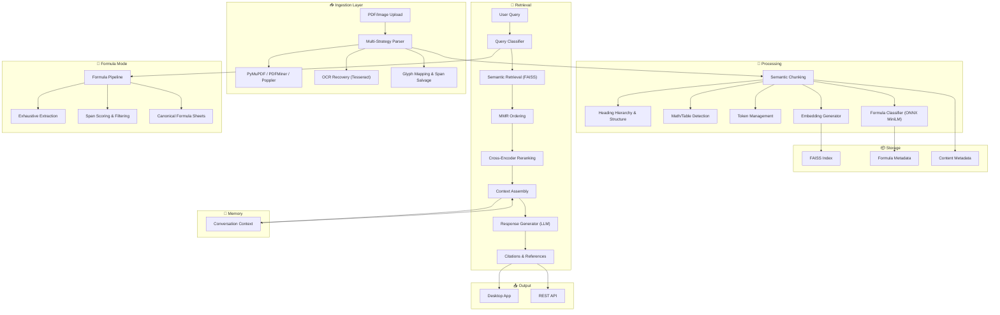

# Anagnosis  

**AI-powered document intelligence for research and knowledge synthesis**  

Anagnosis is an advanced **retrieval-augmented generation (RAG)** system built for academic and technical workflows. It combines **multi-strategy PDF parsing**, **AI-driven formula recognition**, and **semantic retrieval** into a single platform that transforms unstructured documents into structured, citation-ready knowledge.  

> ⚠️ **Status:** Work in Progress — this project is unfinished and under active development. It is primarily a demonstration of technical skill, not a production-ready tool.  

---

## Features  

- **Multi-Strategy Parsing**  
  PyMuPDF, PDFMiner, and Poppler with OCR fallback (Tesseract), glyph mapping, and error recovery.  

- **Formula Intelligence**  
  ONNX-based MiniLM classifier, formula mode, context-aware extraction, canonical LaTeX export.  

- **Semantic Retrieval**  
  FAISS vector search, embeddings, MMR ordering, SFT-based reranking, cross-encoder integration.  

- **Chunking & Embeddings**  
  Structure-preserving segmentation with heading hierarchy, math/table detection, and token overlap control.  

- **Conversation Memory**  
  Persistent context across queries, intelligent pruning, and context-aware assembly.  

- **API + GUI**  
  REST endpoints via FastAPI and a PySide6 desktop interface.  

---

## System Overview  

---

## Tech Stack  

- **Retrieval-Augmented Generation (RAG)** pipeline with FAISS + MMR + reranking  
- **LLMs**: OpenAI GPT, HuggingFace backends, vLLM server support  
- **SFT reranking**: Supervised fine-tuned models for relevance optimization  
- **Formula Classification**: Custom ONNX MiniLM model for mathematical content  
- **OCR**: Tesseract with math-aware configurations  
- **Chunking**: Semantic, structure-preserving segmentation  
- **APIs & Interfaces**: FastAPI backend and PySide6 desktop GUI  

---

## Current Status  

- Multi-strategy document parsing with OCR fallback  
- Formula classification via ONNX MiniLM model  
- FAISS-based semantic retrieval + reranking  
- Persistent conversation memory  
- GUI + REST API available  
- Citation-ready responses  

---

## Purpose  

This project is intended to demonstrate applied skills in:  

- Retrieval-augmented generation (RAG) design  
- Large Language Model (LLM) orchestration  
- Supervised Fine-Tuning (SFT) and reranking integration  
- Embedding pipelines with FAISS and semantic search  
- Multi-strategy document parsing and OCR recovery  
- ONNX runtime deployment for lightweight inference  
- Designing hybrid systems combining symbolic and neural methods  
- Full-stack development: API design, GUI design, and backend architecture  
