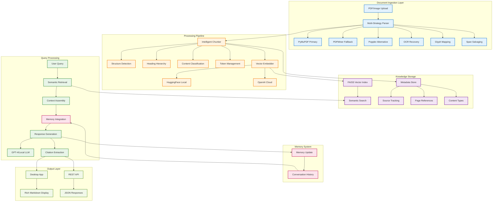

# Anagnosis

**Advanced document intelligence system using retrieval-augmented generation for academic research and knowledge synthesis.**

> **⚠️ Work in Progress**: This software is currently under development. It will be packaged as a standalone application. Current functionality requires manual setup and may differ from the final product.

---

## What Makes Anagnosis Different

### **Intelligent Document Processing**
Unlike basic PDF readers, Anagnosis uses **multi-layered text extraction** with automatic fallback strategies:
- **Primary**: PyMuPDF for fast, accurate text extraction
- **Fallback**: PDFMiner and Poppler for problematic documents
- **OCR Recovery**: Tesseract OCR for scanned pages and corrupted text
- **Glyph Mapping**: Custom font maps to decode private Unicode areas
- **Span Salvaging**: Targeted OCR on suspicious text regions

### **Context-Aware Knowledge Synthesis**
Traditional tools search individual documents. Anagnosis builds a **unified knowledge graph**:
- **Cross-Document Understanding**: Synthesize insights from multiple sources simultaneously
- **Semantic Chunking**: Preserve document structure and context boundaries
- **Conversation Memory**: Maintain context across queries for deeper exploration
- **Source Attribution**: Every response includes exact page references and citations

### **Advanced Retrieval Pipeline**
Beyond simple keyword matching:
- **Semantic Search**: Vector embeddings capture meaning, not just words
- **Content-Type Detection**: Identifies math, tables, and structured content
- **Heading Hierarchy**: Preserves document structure in chunks
- **Multi-Modal Processing**: Handles PDFs, images, and mixed content types

### **Conversational Intelligence**
- **Follow-up Questions**: Build on previous queries naturally
- **Context Preservation**: Remember what you've discussed
- **Academic Integrity**: Automatic citation generation with page numbers
- **Evidence Snippets**: Direct quotes supporting each claim

---

## System Architecture



## Core Features

### **Robust Document Processing**
- **Multi-Format Support**: PDFs, images (PNG, JPG, TIFF, WebP, BMP)
- **OCR Integration**: Automatic text recognition for scanned documents
- **Error Recovery**: Multiple extraction strategies for problematic files
- **Quality Detection**: Identifies and flags suspicious or low-quality text
- **Font Decoding**: Custom glyph mapping for specialized fonts

### **Intelligent Chunking**
- **Structure Preservation**: Maintains headings, lists, and document hierarchy
- **Content-Aware Splitting**: Recognizes math, tables, and formatted content
- **Overlap Management**: Smart token overlap for context continuity
- **Reading Order**: Handles multi-column layouts and complex page structures
- **Header/Footer Removal**: Automatically filters repetitive page elements

### **Advanced Retrieval**
- **Semantic Similarity**: Vector-based search beyond keyword matching
- **Content Classification**: Separate handling for math, tables, and text
- **Reranking Support**: Optional result refinement with specialized models
- **Metadata Filtering**: Search by document type, page range, or content features
- **Hybrid Search**: Combines semantic and lexical matching strategies

### **Persistent Memory**
- **Conversation Context**: Maintains discussion history across sessions
- **Token Management**: Intelligent context window optimization
- **Memory Pruning**: Automatic cleanup to manage storage limits
- **Context Assembly**: Integrates relevant history with current queries

---

## Use Cases

### 📖 **Academic Research**
Transform your research workflow:
```
Query: "How do different theories of social capital relate to economic development?"

Response: Based on your collection, social capital theories show three main connections to economic development:

**Network Theory Perspective** (Granovetter, 1973):
- Weak ties facilitate information flow and job opportunities [Networks_Paper.pdf p.15]
- Bridge connections across social groups enable resource access [Social_Capital_Review.pdf p.203]

**Institutional Trust Framework** (Putnam, 1995):
- Civic engagement correlates with regional economic performance [Bowling_Alone.pdf p.287]
- Social trust reduces transaction costs in market exchanges [Trust_Economics.pdf p.45]

**Human Capital Integration** (Coleman, 1988):
- Social capital complements individual skills and education [Foundations.pdf p.112]
- Community networks enhance knowledge spillovers [Development_Theory.pdf p.78]

Citations: [Networks_Paper.pdf p.15], [Social_Capital_Review.pdf p.203], [Bowling_Alone.pdf p.287], [Trust_Economics.pdf p.45], [Foundations.pdf p.112], [Development_Theory.pdf p.78]
```

### 📝 **Literature Reviews**
Accelerate systematic analysis:
- **Theme Identification**: Find common patterns across papers
- **Methodology Comparison**: Compare research approaches and findings
- **Gap Analysis**: Identify underexplored areas in your field
- **Citation Networks**: Trace how ideas develop across publications

### 🎓 **Study Materials**
Create comprehensive study resources:
- **Cross-Course Synthesis**: Connect concepts from different classes
- **Exam Preparation**: Generate practice questions and summaries
- **Concept Mapping**: Understand relationships between ideas
- **Bibliography Generation**: Automatic reference compilation

---

## Installation and Setup

### Prerequisites

**System Requirements:**
- Python 3.8 or higher
- Tesseract OCR engine

**Install Tesseract:**
```bash
# macOS
brew install tesseract

# Ubuntu/Debian
sudo apt-get install tesseract-ocr

# Windows
# Download from: https://github.com/UB-Mannheim/tesseract/wiki
```

### Installation Steps

1. **Clone Repository:**
   ```bash
   git clone https://github.com/Duncanyu/anagnosis.git
   cd anagnosis
   ```

2. **Install Dependencies:**
   ```bash
   pip install fastapi uvicorn pyside6 pymupdf pillow pytesseract faiss-cpu numpy openai transformers torch sentence-transformers markdown keyring pydantic
   ```

3. **Configure Settings:**
   The application uses multiple configuration methods:
   - **GUI Settings**: Use the desktop app's Settings dialog
   - **Config File**: Create `config.local.json` in the project root
   - **Environment Variables**: Set API keys and preferences
   - **System Keyring**: Secure storage for API keys (recommended)

   Example `config.local.json`:
   ```json
   {
     "OPENAI_API_KEY": "your_openai_key_here",
     "HF_TOKEN": "your_huggingface_token",
     "EMBED_BACKEND": "hf",
     "LLM_BACKEND": "openai"
   }
   ```

4. **Run Application:**
   ```bash
   # Desktop Interface (Recommended)
   python app/app_qt.py
   
   # API Server
   uvicorn api.main:app --reload --host 0.0.0.0 --port 8000
   ```

---

## Technical Implementation

### Document Processing Engine

**Multi-Strategy Text Extraction:**
```python
# Primary extraction with PyMuPDF
base_text = extract_text_mupdf(doc, page_num)

# Fallback strategies for problematic content
if suspicious(base_text):
    # Try alternative extractors
    pdfminer_text = extract_text_pdfminer(pdf_bytes, page_num)
    poppler_text = extract_text_poppler(pdf_bytes, page_num)
    
    # Custom glyph mapping for private Unicode areas
    if has_private_unicode(base_text):
        mapped_text = rebuild_with_pua_maps(doc, page_num)
    
    # Targeted OCR for bad spans
    if still_problematic(best_text):
        salvaged_text = salvage_bad_spans(doc, page_num)
    
    # Full page OCR as last resort
    if len(best_text) < 10:
        ocr_text = ocr_page(doc, page_num)
```

**Intelligent Quality Assessment:**
- **Character Analysis**: ASCII ratio, Unicode normalization
- **Content Heuristics**: Length, structure, language detection
- **Visual Inspection**: Bounding box analysis for layout understanding
- **Error Recovery**: Multiple extraction attempts with scoring

### Semantic Chunking System

**Structure-Aware Segmentation:**
```python
# Detect document structure
heading_hierarchy = extract_headings(text)
list_items = detect_bullets_and_numbering(text)
content_blocks = identify_paragraphs_tables_math(text)

# Preserve context boundaries
chunks = []
for block in content_blocks:
    if exceeds_token_limit(current_chunk + block):
        # Smart overlap with previous context
        overlap_text = extract_relevant_overlap(current_chunk)
        chunks.append(finalize_chunk(current_chunk, metadata))
        current_chunk = overlap_text + block
    else:
        current_chunk += block
```

**Content Classification:**
- **Mathematical Content**: LaTeX symbols, equations, formulas
- **Tabular Data**: Column detection, structured information
- **Code Blocks**: Programming languages, technical syntax
- **Citations**: Reference patterns, bibliography entries

### Vector Embedding Pipeline

**Multi-Backend Support:**
```python
# Local embeddings with HuggingFace
if backend == "hf":
    model = SentenceTransformer("intfloat/e5-small-v2")
    embeddings = model.encode(chunks, show_progress_bar=True)

# Cloud embeddings with OpenAI
elif backend == "openai":
    embeddings = openai.embeddings.create(
        model="text-embedding-3-small",
        input=chunks
    )
```

**Optimization Features:**
- **Batch Processing**: Efficient bulk embedding generation
- **Caching**: Avoid re-embedding unchanged content
- **Rate Limiting**: Respect API quotas and limits
- **Error Handling**: Graceful fallbacks for failed requests

### Memory Management System

**Conversation Context:**
```python
# Load recent conversation history
history = load_recent_memory(token_limit=1200)

# Integrate with current query
context = assemble_context(
    query=user_question,
    retrieved_chunks=relevant_passages,
    conversation_history=history
)

# Update memory after response
append_turn(question=user_question, answer=response)
prune_memory_file(max_size_mb=50)
```

**Context Assembly:**
- **Token Budgeting**: Intelligent allocation of context window
- **Relevance Scoring**: Prioritize most important historical context
- **Temporal Decay**: Weight recent conversations more heavily
- **Topic Continuity**: Maintain thematic coherence across turns

### FAISS Vector Index

**High-Performance Search:**
```python
# Build optimized index
index = faiss.IndexFlatIP(embedding_dimension)
index.add(document_embeddings.astype('float32'))

# Semantic similarity search
query_embedding = embed_query(user_question)
scores, indices = index.search(query_embedding, k=top_k)

# Retrieve with metadata
results = []
for score, idx in zip(scores[0], indices[0]):
    chunk = chunks[idx]
    chunk['similarity_score'] = float(score)
    results.append(chunk)
```

**Index Management:**
- **Incremental Updates**: Add new documents without rebuilding
- **Metadata Preservation**: Source tracking and citation information
- **Memory Efficiency**: Optimized storage for large collections
- **Search Optimization**: Fast approximate nearest neighbor search

### Response Generation Pipeline

**Context-Aware Synthesis:**
```python
# Assemble comprehensive context
prompt = build_rag_prompt(
    question=user_query,
    retrieved_passages=relevant_chunks,
    conversation_history=recent_turns,
    system_instructions=academic_guidelines
)

# Generate grounded response
response = llm.generate(
    prompt=prompt,
    max_tokens=response_limit,
    temperature=0.1  # Low temperature for factual accuracy
)

# Extract citations and evidence
citations = extract_page_references(response, source_chunks)
evidence_snippets = identify_supporting_quotes(response, passages)
```

**Quality Assurance:**
- **Source Grounding**: Responses constrained to retrieved content
- **Citation Accuracy**: Automatic page number and source verification
- **Factual Consistency**: Cross-reference claims with source material
- **Academic Standards**: Proper attribution and evidence support

---

## Configuration Options

### Multi-Layer Configuration System

**Priority Order:**
1. **Environment Variables** (highest priority)
2. **System Keyring** (secure credential storage)
3. **Local Config File** (`config.local.json`)
4. **Application Defaults** (fallback values)

### Core Settings

```json
{
  "OPENAI_API_KEY": "your_openai_key_here",
  "HF_TOKEN": "your_huggingface_token",
  "COHERE_API_KEY": "your_cohere_key",
  "EMBED_BACKEND": "hf",
  "LLM_BACKEND": "openai",
  "RERANK_BACKEND": "hf",
  "QDRANT_URL": "optional_qdrant_endpoint"
}
```

### Performance Tuning

**Memory Management:**
- `MEMORY_ENABLED`: Enable conversation context (true/false)
- `MEMORY_TOKEN_LIMIT`: Context window size (default: 1200)
- `MEMORY_FILE_LIMIT_MB`: Storage limit for conversation history (default: 50)

**API Rate Limiting:**
- `OPENAI_TPM`: Tokens per minute limit for OpenAI API
- `OPENAI_RPM`: Requests per minute limit for OpenAI API
- `ASK_TIME_BUDGET_SEC`: Maximum time for query processing (default: 120)

**Batch Processing:**
- `ASK_BATCH_CHAR_BUDGET`: Character limit per batch (default: 12000)
- `ASK_MAX_BATCHES`: Maximum number of batches per query (default: 6)

### Advanced Configuration

**Custom Models:**
```bash
# Local LLM server
export LLM_BACKEND=vllm
export LLM_OPENAI_BASE=http://localhost:8001/v1

# Custom embedding model
export EMBED_MODEL=sentence-transformers/all-MiniLM-L6-v2
```

**Development Settings:**
```bash
# Enable debug logging
export DEBUG=true

# Custom artifact storage
export ARTIFACTS_PATH=/path/to/custom/storage

# OCR language configuration
export TESSERACT_LANG=eng+equ
```

---

## API Reference

### REST Endpoints

**Document Upload:**
```bash
POST /upload/
Content-Type: multipart/form-data

curl -X POST "http://localhost:8000/upload/" \
     -F "file=@document.pdf"
```

**Query Knowledge Base:**
```bash
POST /query/
Content-Type: application/json

curl -X POST "http://localhost:8000/query/" \
     -H "Content-Type: application/json" \
     -d '{
       "question": "What are the main findings?",
       "k": 8
     }'
```

**Manage API Keys:**
```bash
GET /secrets/status/     # Check configured keys
POST /secrets/set/       # Update API keys
```

### Python Client

```python
import requests
from pathlib import Path

class AnagnosisClient:
    def __init__(self, base_url="http://localhost:8000"):
        self.base_url = base_url
    
    def upload_document(self, file_path):
        """Upload document to knowledge base"""
        with open(file_path, "rb") as f:
            response = requests.post(
                f"{self.base_url}/upload/",
                files={"file": f}
            )
        return response.json()
    
    def query(self, question, k=5):
        """Query the knowledge base"""
        response = requests.post(
            f"{self.base_url}/query/",
            json={"question": question, "k": k}
        )
        return response.json()
    
    def batch_upload(self, directory_path):
        """Upload all PDFs in a directory"""
        results = []
        for pdf_file in Path(directory_path).glob("*.pdf"):
            result = self.upload_document(pdf_file)
            results.append({"file": pdf_file.name, "result": result})
        return results

# Usage example
client = AnagnosisClient()
client.upload_document("research_paper.pdf")
response = client.query("What are the key findings about social capital?")
print(response["answer"])
```

---

## Project Structure

```
anagnosis/
├── app/
│   └── app_qt.py              # Desktop GUI application
├── api/
│   ├── main.py                # FastAPI server entry point
│   ├── core/
│   │   └── config.py          # Multi-layer configuration system
│   ├── routes/
│   │   ├── upload.py          # Document ingestion endpoints
│   │   ├── query.py           # RAG query processing
│   │   └── secrets.py         # API key management
│   └── services/
│       ├── parse.py           # Multi-strategy document parsing
│       ├── chunk.py           # Intelligent semantic chunking
│       ├── embed.py           # Vector embedding generation
│       ├── index.py           # FAISS vector indexing
│       ├── summarize.py       # RAG response generation
│       ├── memory.py          # Conversation context management
│       └── aliases.py         # Terminology and alias handling
├── artifacts/                 # Knowledge base storage
│   ├── index.faiss           # Vector search index
│   ├── meta.json             # Document metadata
│   ├── chunks.jsonl          # Text segments with embeddings
│   ├── memory.jsonl          # Conversation history
│   ├── doc_summaries.jsonl   # Document summaries
│   ├── ui_prefs.json         # GUI preferences
│   └── font_maps/            # Custom glyph mappings
└── config.local.json         # Local configuration file
```

---

## Development Status

### Current Capabilities ✅
- **Multi-strategy document parsing** with OCR fallbacks
- **Intelligent semantic chunking** preserving document structure
- **Vector-based semantic search** with FAISS indexing
- **Conversation memory** with context management
- **Multi-backend support** for embeddings and LLMs
- **Desktop GUI** with real-time processing feedback
- **REST API** for programmatic access
- **Automatic citation generation** with page references

### Advanced Features ✅
- **Glyph mapping** for custom fonts and private Unicode areas
- **Span salvaging** with targeted OCR for problematic text
- **Content classification** for math, tables, and structured data
- **Header/footer detection** and automatic removal
- **Multi-column layout** handling with reading order preservation
- **Quality assessment** and suspicious content flagging

### Known Limitations ⚠️
- **Manual installation** and configuration required
- **Local deployment** only (no cloud hosting)
- **Performance scaling** depends on document collection size
- **Memory usage** grows with conversation history
- **OCR accuracy** varies with document quality

### Planned Enhancements 🚀
- **Hybrid search** combining semantic and lexical matching
- **Advanced reranking** with specialized models
- **Document relationship** modeling and cross-references
- **Collaborative features** for shared knowledge bases
- **Export capabilities** for citations and bibliographies
- **Plugin system** for custom document processors

---

## Contributing

We welcome contributions in several key areas:

### **Core Pipeline Improvements**
- **Document Processing**: Enhanced OCR, new file format support
- **Chunking Strategies**: Better boundary detection, structure preservation
- **Embedding Models**: Integration of new embedding backends
- **Search Algorithms**: Hybrid search, query expansion techniques

### **Feature Development**
- **User Interface**: GUI enhancements, workflow improvements
- **API Extensions**: New endpoints, batch processing capabilities
- **Memory Management**: Advanced context strategies, relevance scoring
- **Citation Systems**: Enhanced bibliography generation, format support

### **Documentation & Testing**
- **Code Documentation**: Inline comments, API documentation
- **Test Coverage**: Unit tests, integration tests, performance benchmarks
- **User Guides**: Tutorials, best practices, troubleshooting guides
- **Academic Examples**: Domain-specific use cases and workflows

### Development Guidelines

**Code Standards:**
- Follow existing architecture patterns and naming conventions
- Include comprehensive docstrings and type hints
- Add appropriate error handling and logging
- Maintain backward compatibility when possible

**Testing Requirements:**
- Write unit tests for new functionality
- Include integration tests for API endpoints
- Test with various document types and edge cases
- Verify performance impact of changes

**Documentation:**
- Update README for new features or configuration options
- Add inline code comments for complex algorithms
- Include usage examples and best practices
- Document any breaking changes or migration steps

---

## License

This project is released under the **MIT License**. See the [LICENSE](LICENSE) file for complete details.

### Third-Party Components

Anagnosis incorporates several open-source libraries:
- **PyMuPDF**: PDF processing and text extraction
- **Tesseract**: Optical character recognition
- **FAISS**: Vector similarity search
- **HuggingFace Transformers**: Embedding models and tokenization
- **PySide6**: Desktop GUI framework
- **FastAPI**: Web API framework

---

## Support & Community

### 🐛 **Bug Reports**
- **GitHub Issues**: Report bugs and feature requests
- **Include Details**: System info, error messages, reproduction steps
- **Minimal Examples**: Provide sample documents when possible

### 💬 **Discussion & Help**
- **GitHub Discussions**: General questions and community support
- **Documentation**: Comprehensive guides and API reference
- **Code Examples**: Sample implementations and use cases

### 📧 **Contact**
- **Project Maintainer**: [GitHub Profile](https://github.com/Duncanyu)
- **Repository**: [Anagnosis on GitHub](https://github.com/Duncanyu/anagnosis)

### 🤝 **Community Guidelines**
- Be respectful and constructive in discussions
- Search existing issues before creating new ones
- Provide clear, reproducible examples when reporting problems
- Follow the code of conduct in all interactions

---

**Ready to transform your research workflow? Get started with Anagnosis today!**
