# 📚 Reading Agent
### *Your AI-Powered Study Companion & Document Intelligence System*

> **Transform your academic readings into interactive knowledge.** Upload PDFs, ask questions, get instant answers with citations. Perfect for university students drowning in readings and hiring managers reviewing resumes at scale.

---

## 🎯 Why Reading Agent?

**For Students:**
- 📖 **Never miss key concepts** - Upload course readings and get instant answers to study questions
- 🎓 **Ace your exams** - Auto-generated summaries with page citations for efficient review
- 💬 **Study conversations** - Memory-enabled chat that remembers your previous questions
- 📝 **Smart note-taking** - Extract key terms, formulas, and evidence snippets automatically

**For Hiring Managers:**
- 📄 **Resume intelligence** - Upload candidate resumes and query specific qualifications instantly
- 🔍 **Bulk screening** - Process hundreds of applications with targeted questions
- 📊 **Evidence-based decisions** - Get direct quotes and page references for every answer
- ⚡ **10x faster reviews** - Turn hours of manual screening into minutes of intelligent queries

---

## 🚀 How It Works

```mermaid
graph TB
    subgraph "📥 Input"
        A[PDF Documents]
        B[Scanned Images]
        C[Course Readings]
        D[Resumes/CVs]
    end
    
    subgraph "🔄 Processing Pipeline"
        E[Smart Parser<br/>📄 PDF + OCR]
        F[Intelligent Chunker<br/>🧩 Semantic Segments]
        G[Vector Embeddings<br/>🧠 AI Understanding]
        H[FAISS Index<br/>⚡ Lightning Search]
    end
    
    subgraph "💾 Knowledge Base"
        I[Vector Database<br/>🗃️ Searchable Content]
        J[Document Summaries<br/>📋 Auto-Generated]
        K[Conversation Memory<br/>🧠 Context Aware]
        L[Smart Aliases<br/>🏷️ Your Terminology]
    end
    
    subgraph "🤖 AI Engine"
        M[Semantic Search<br/>🎯 Relevance Ranking]
        N[GPT-4 Integration<br/>💡 Smart Answers]
        O[Citation Engine<br/>📚 Source Tracking]
        P[Evidence Extraction<br/>💎 Key Quotes]
    end
    
    subgraph "📤 Output"
        Q[Precise Answers<br/>✅ With Citations]
        R[Evidence Snippets<br/>📝 Direct Quotes]
        S[Study Summaries<br/>📖 Structured Notes]
        T[Interactive Chat<br/>💬 Contextual Q&A]
    end
    
    A --> E
    B --> E
    C --> E
    D --> E
    
    E --> F
    F --> G
    G --> H
    
    H --> I
    F --> J
    N --> K
    G --> L
    
    I --> M
    J --> M
    K --> M
    L --> M
    
    M --> N
    N --> O
    O --> P
    
    P --> Q
    P --> R
    J --> S
    K --> T
    
    style A fill:#e1f5fe
    style B fill:#e1f5fe
    style C fill:#e1f5fe
    style D fill:#e1f5fe
    style Q fill:#e8f5e8
    style R fill:#e8f5e8
    style S fill:#e8f5e8
    style T fill:#e8f5e8
    style N fill:#fff3e0
    style M fill:#f3e5f5
```



## ✨ Key Features

### 🎓 **Academic Powerhouse**
- **Multi-format Support**: PDFs, images, scanned documents with OCR
- **Smart Summarization**: Auto-generated study notes with section breakdowns
- **Citation Tracking**: Every answer includes precise page references
- **Memory System**: Remembers your study sessions for contextual follow-ups

### 🔍 **Advanced Search & AI**
- **Semantic Understanding**: Finds relevant content even with different wording
- **Evidence Extraction**: Highlights key quotes that support each answer
- **Alias Learning**: Adapts to your preferred terminology ("ML" → "Machine Learning")
- **Multi-backend Support**: OpenAI GPT-4, local models, or HuggingFace

### 💻 **Dual Interface**
- **Desktop App**: Beautiful Qt interface for focused study sessions
- **REST API**: Integrate with your existing workflows and tools
- **Conversation Memory**: Maintains context across questions
- **Flexible Configuration**: Customize backends, memory limits, and more

---

## 🏃‍♂️ Quick Start

### Option 1: Desktop App (Recommended for Students)

```bash
# Clone and install
git clone https://github.com/Duncanyu/reading-agent.git
cd reading-agent
pip install fastapi uvicorn pyside6 pymupdf pillow pytesseract faiss-cpu numpy openai transformers torch sentence-transformers markdown

# Set up your API keys
cp .env.example .env
# Edit .env with your OpenAI API key

# Launch the app
python app/app_qt.py
```

**Workflow:**
1. **Settings** → Add your OpenAI API key, enable memory
2. **Ingest** → Upload your course readings or documents
3. **Ask** → Start asking questions about your content!

### Option 2: API Server (For Developers & Integration)

```bash
# Start the server
uvicorn api.main:app --reload --host 0.0.0.0 --port 8000

# Upload a document
curl -X POST "http://localhost:8000/upload/" \
     -H "Content-Type: multipart/form-data" \
     -F "file=@your-document.pdf"

# Ask questions
curl -X POST "http://localhost:8000/query/" \
     -H "Content-Type: application/json" \
     -d '{"question": "What are the main findings?", "k": 5}'
```

---

## 🎯 Real-World Use Cases

### 📚 **For Students**

**Scenario**: You have 200 pages of economics readings due tomorrow.

```
You: "What is the main argument about market efficiency?"

Reading Agent: "**The main argument is that markets are informationally efficient under specific conditions but fail with asymmetric information.**

Key points:
- Perfect information leads to optimal resource allocation [Economics101.pdf p.45]
- Information asymmetries create market failures [Economics101.pdf p.67-68]
- Government intervention may be justified in these cases [Economics101.pdf p.72]

**Citations:** [Economics101.pdf p.45], [Economics101.pdf p.67-68], [Economics101.pdf p.72]

### Evidence snippets
> "Under conditions of perfect information, competitive markets achieve Pareto optimal outcomes through the invisible hand mechanism."
> — [Economics101.pdf p.45]
```

### 💼 **For Hiring Managers**

**Scenario**: Screening 50 software engineer resumes for React experience.

```
You: "Does this candidate have React experience and what projects did they work on?"

Reading Agent: "**Yes, the candidate has 3+ years of React experience with multiple production projects.**

Experience details:
- Senior Frontend Developer at TechCorp (2021-2024) [Resume.pdf p.1]
- Built e-commerce platform serving 100k+ users [Resume.pdf p.1]
- Led React migration project reducing load times by 40% [Resume.pdf p.2]

**Citations:** [Resume.pdf p.1], [Resume.pdf p.2]

### Evidence snippets
> "Led frontend team in migrating legacy jQuery application to React, resulting in 40% faster page load times and improved user engagement metrics."
> — [Resume.pdf p.2]
```

---

## 🛠️ Technical Architecture

### Core Components

```
reading-agent/
├── 🖥️  app/app_qt.py           # Qt Desktop Application
├── 🌐 api/                     # FastAPI Backend
│   ├── main.py                 # API Entry Point
│   ├── routes/                 # REST Endpoints
│   │   ├── upload.py          # Document Upload
│   │   ├── query.py           # Q&A Interface
│   │   └── secrets.py         # API Key Management
│   └── services/              # Core Intelligence
│       ├── parse.py           # PDF/Image Processing
│       ├── chunk.py           # Semantic Chunking
│       ├── embed.py           # Vector Embeddings
│       ├── index.py           # FAISS Vector Search
│       ├── summarize.py       # AI Summarization
│       ├── memory.py          # Conversation Context
│       └── aliases.py         # Terminology Learning
└── 📁 artifacts/              # Generated Data
    ├── index.faiss            # Vector Database
    ├── chunks.jsonl           # Document Chunks
    ├── memory.jsonl           # Chat History
    └── doc_summaries.jsonl    # Auto Summaries
```

### Processing Pipeline

1. **Document Ingestion**
   - PyMuPDF for PDF parsing
   - Tesseract OCR for scanned content
   - PIL for image processing
   - Semantic chunking with overlap

2. **Vector Indexing**
   - HuggingFace `e5-small-v2` embeddings (default)
   - OpenAI `text-embedding-3-small` (optional)
   - FAISS for efficient similarity search
   - Metadata preservation for citations

3. **Query Processing**
   - Semantic search with relevance ranking
   - Context-aware reranking
   - GPT-4 for answer generation
   - Evidence extraction with quote highlighting

4. **Memory & Learning**
   - Conversation history with token limits
   - Automatic alias learning and application
   - Document summarization caching
   - User preference persistence

### Supported Backends

| Component | Options | Notes |
|-----------|---------|-------|
| **Embeddings** | HuggingFace, OpenAI | Local vs. API-based |
| **LLM** | GPT-4, vLLM, HuggingFace | Quality vs. cost trade-offs |
| **Reranking** | HuggingFace, Cohere, None | Improves result relevance |
| **Vector DB** | FAISS, Qdrant | In-memory vs. persistent |

### Configuration Options

```env
# Backend Selection
EMBED_BACKEND=hf              # hf|openai
LLM_BACKEND=openai            # openai|vllm
RERANK_BACKEND=hf             # hf|cohere|none

# Memory Management
MEMORY_ENABLED=true           # Enable conversation context
MEMORY_TOKEN_LIMIT=1200       # Context window size
MEMORY_FILE_LIMIT_MB=50       # Storage limit

# API Keys
OPENAI_API_KEY=your_key_here
HF_TOKEN=your_hf_token
COHERE_API_KEY=your_cohere_key
```

---

## 📊 Performance & Scalability

### Benchmarks
- **Document Processing**: ~2-5 seconds per PDF page
- **Query Response**: ~1-3 seconds with OpenAI backend
- **Memory Usage**: ~100MB base + ~1MB per 100 document pages
- **Concurrent Users**: 10+ simultaneous queries (API mode)

### Optimization Tips
- Use GPU acceleration for embeddings when available
- Adjust chunk size for memory vs. accuracy trade-offs
- Enable reranking for better result quality
- Use local models to reduce API costs

---

## 🔧 Advanced Configuration

### Custom Model Integration

```python
# Use local vLLM server
LLM_BACKEND=vllm
LLM_OPENAI_BASE=http://localhost:8001/v1

# Custom embedding model
EMBED_MODEL=sentence-transformers/all-MiniLM-L6-v2
```

### Memory Tuning

```python
# For large document collections
MEMORY_TOKEN_LIMIT=2000
MEMORY_FILE_LIMIT_MB=100

# For resource-constrained environments
MEMORY_TOKEN_LIMIT=800
MEMORY_FILE_LIMIT_MB=25
```

### API Integration Examples

```python
import requests

# Upload document
with open("document.pdf", "rb") as f:
    response = requests.post(
        "http://localhost:8000/upload/",
        files={"file": f}
    )

# Query with custom parameters
response = requests.post(
    "http://localhost:8000/query/",
    json={
        "question": "What are the key findings?",
        "k": 10  # Return top 10 chunks
    }
)

result = response.json()
print(f"Answer: {result['answer']}")
print(f"Citations: {result['citations']}")
```

---

## 🚧 Roadmap

**Current Status**: MVP Complete ✅

**Coming Soon**:
- 📱 **Single App Export** - Standalone executable for easy distribution
- 🌐 **Web Interface** - Browser-based UI for universal access
- 📊 **Analytics Dashboard** - Study progress and document insights
- 🔗 **Integration APIs** - Connect with LMS platforms and note-taking apps
- 🎨 **Custom Themes** - Personalized UI for different use cases
- 🌍 **Multi-language Support** - Process documents in various languages

---

## 🤝 Contributing

We welcome contributions! Whether you're fixing bugs, adding features, or improving documentation:

1. Fork the repository
2. Create a feature branch (`git checkout -b feature/amazing-feature`)
3. Commit your changes (`git commit -m 'Add amazing feature'`)
4. Push to the branch (`git push origin feature/amazing-feature`)
5. Open a Pull Request

---

## 📄 License

This project is open source under the MIT License. See `LICENSE` file for details.

---

## 🆘 Support

- 📖 **Documentation**: Check the code comments and examples
- 🐛 **Bug Reports**: Open an issue on GitHub
- 💡 **Feature Requests**: We'd love to hear your ideas!
- 📧 **Contact**: Reach out through GitHub issues

---

<div align="center">

**Ready to transform your reading experience?**

[⭐ Star this repo](https://github.com/Duncanyu/reading-agent) • [🍴 Fork it](https://github.com/Duncanyu/reading-agent/fork) • [📥 Download](https://github.com/Duncanyu/reading-agent/archive/main.zip)

*Built with ❤️ for students and professionals who value their time*

</div>
