# Anagnosis

**Intelligent document processing system with cross-course integration and context-aware knowledge synthesis.**

> **⚠️ Work in Progress**: This software is currently under development. The final release will be packaged as a standalone application. Current functionality requires manual setup and may differ from the final product.

---

## What Makes Anagnosis Different

Anagnosis transforms how students and researchers interact with their document collections by building a unified knowledge base that understands connections across disciplines, courses, and time periods. Unlike traditional document readers or note-taking apps, Anagnosis uses retrieval-augmented generation (RAG) to provide context-aware responses that draw from your entire academic corpus.

### Core Capabilities

**Personal Academic Vault**
Build a comprehensive, searchable repository of all academic materials. Every document becomes part of an interconnected knowledge graph that grows more valuable with each addition. Query concepts across semesters, find connections between courses, and access insights that span your entire academic journey.

**Automatic Citation & Source Management**
Every response includes precise page references and source citations. Generate bibliographies automatically, verify claims against original sources, and maintain academic integrity with built-in fact-checking capabilities. No more manual citation hunting or lost references.

**Cross-Course Knowledge Integration**
Discover interdisciplinary connections that traditional tools miss. Ask questions that span multiple courses and receive answers that synthesize insights from economics, psychology, history, and other fields simultaneously. Understand how concepts from different disciplines inform each other.

**Context-Aware Document Synthesis**
RAG-powered responses understand the full context of your academic work. Generate study materials that combine insights from multiple sources, create comprehensive research summaries, and produce analysis that considers the broader academic conversation rather than isolated documents.

---

## System Architecture

```mermaid
graph TB
    subgraph "Document Input"
        A[Course Readings<br/>📚 PDFs, Papers]
        B[Lecture Materials<br/>📄 Slides, Notes]  
        C[Research Sources<br/>🔬 Articles, Books]
        D[Personal Documents<br/>📝 Essays, Reports]
    end
    
    subgraph "Intelligent Processing"
        E[Document Parser<br/>🔍 Text + OCR Extraction]
        F[Semantic Chunker<br/>✂️ Context-Aware Segmentation]
        G[Knowledge Embedder<br/>🧠 Vector Representations]
        H[Cross-Reference Builder<br/>🔗 Relationship Mapping]
    end
    
    subgraph "Knowledge Base"
        I[Vector Index<br/>⚡ Semantic Search Engine]
        J[Citation Database<br/>📖 Source + Page Tracking]
        K[Context Memory<br/>🧠 Conversation History]
        L[Concept Graph<br/>🕸️ Cross-Course Connections]
    end
    
    subgraph "RAG Query Engine"
        M[Semantic Retrieval<br/>🎯 Multi-Source Search]
        N[Context Assembly<br/>📋 Relevant Passage Selection]
        O[Knowledge Synthesis<br/>💡 Cross-Document Analysis]
        P[Citation Generation<br/>📚 Automatic Referencing]
    end
    
    subgraph "User Interface"
        Q[Desktop Application<br/>🖥️ Interactive GUI]
        R[API Endpoints<br/>🌐 Programmatic Access]
        S[Structured Responses<br/>📊 Citations + Evidence]
    end
    
    A --> E
    B --> E
    C --> E
    D --> E
    
    E --> F
    F --> G
    G --> H
    
    H --> I
    H --> J
    O --> K
    H --> L
    
    I --> M
    J --> M
    K --> M
    L --> M
    
    M --> N
    N --> O
    O --> P
    
    P --> Q
    P --> R
    P --> S
    
    style A fill:#e3f2fd,stroke:#1976d2,stroke-width:2px
    style B fill:#e3f2fd,stroke:#1976d2,stroke-width:2px
    style C fill:#e3f2fd,stroke:#1976d2,stroke-width:2px
    style D fill:#e3f2fd,stroke:#1976d2,stroke-width:2px
    
    style I fill:#f3e5f5,stroke:#7b1fa2,stroke-width:2px
    style J fill:#f3e5f5,stroke:#7b1fa2,stroke-width:2px
    style K fill:#f3e5f5,stroke:#7b1fa2,stroke-width:2px
    style L fill:#f3e5f5,stroke:#7b1fa2,stroke-width:2px
    
    style Q fill:#e8f5e8,stroke:#388e3c,stroke-width:2px
    style R fill:#e8f5e8,stroke:#388e3c,stroke-width:2px
    style S fill:#e8f5e8,stroke:#388e3c,stroke-width:2px
```



## Key Features

### Knowledge Indexing & Academic Vault
- **Unified Repository**: All academic materials in one searchable system
- **Persistent Knowledge**: Documents remain accessible across semesters and courses
- **Semantic Organization**: Content organized by concepts, not just file names
- **Growth-Oriented**: System becomes more valuable with each document added

### Citation & Source Management
- **Automatic Tracking**: Every piece of information linked to source and page number
- **Bibliography Generation**: Export citations in standard academic formats
- **Fact Verification**: Cross-reference claims against original sources
- **Quote Extraction**: Relevant passages highlighted with precise attribution

### Cross-Course Integration
- **Interdisciplinary Connections**: Link concepts across different academic fields
- **Temporal Analysis**: Compare how ideas evolve across different time periods
- **Thematic Synthesis**: Identify recurring themes across diverse materials
- **Comparative Analysis**: Examine how different authors approach similar topics

### Context-Aware Generation
- **RAG Architecture**: Responses grounded in your specific document collection
- **Multi-Source Synthesis**: Combine insights from multiple documents simultaneously
- **Contextual Understanding**: System remembers previous queries and builds on them
- **Evidence-Based Responses**: Every answer supported by specific textual evidence

---

## Use Cases

### Academic Research
Transform literature reviews from manual document scanning to intelligent synthesis. Ask broad questions like "How do different authors define social capital?" and receive comprehensive answers that draw from economics, sociology, and political science sources with full citations.

### Study Material Creation
Generate study guides that connect concepts across courses. Create exam preparation materials that show how microeconomics principles apply to policy analysis, or how historical events relate to contemporary political theory.

### Essay and Report Writing
Build arguments supported by evidence from your entire knowledge base. Find supporting quotes, identify counterarguments, and ensure comprehensive coverage of relevant literature with automatic citation formatting.

### Knowledge Discovery
Uncover connections you might have missed. Discover how concepts from different courses relate to each other, identify gaps in your understanding, and find unexpected insights that emerge from cross-disciplinary analysis.

---

## Installation and Setup

### Prerequisites

**System Requirements:**
- Python 3.8 or higher
- Tesseract OCR engine

**Install Tesseract:**
```bash
# macOS
brew install tesseract

# Ubuntu/Debian
sudo apt-get install tesseract-ocr

# Windows
# Download from: https://github.com/UB-Mannheim/tesseract/wiki
```

### Installation Steps

1. **Clone Repository:**
   ```bash
   git clone https://github.com/Duncanyu/reading-agent.git
   cd anagnosis
   ```

2. **Install Dependencies:**
   ```bash
   pip install fastapi uvicorn pyside6 pymupdf pillow pytesseract faiss-cpu numpy openai transformers torch sentence-transformers markdown
   ```

3. **Configure Environment:**
   ```bash
   cp .env.example .env
   # Edit .env with your API keys and preferences
   ```

4. **Run Application:**
   ```bash
   # Desktop Interface
   python app/app_qt.py
   
   # API Server
   uvicorn api.main:app --reload --host 0.0.0.0 --port 8000
   ```

---

## Usage Examples

### Building Your Knowledge Base

**Document Ingestion:**
Upload course readings, research papers, lecture slides, and personal notes. The system automatically extracts text, generates embeddings, and builds cross-references between documents.

**Cross-Course Queries:**
```
Query: "How do behavioral economics insights relate to public policy design?"

Response: "Behavioral economics provides several key insights for public policy design, particularly around choice architecture and nudging...

From your Economics 301 readings:
- Thaler & Sunstein emphasize how default options significantly influence behavior [Nudge.pdf p.83]
- Kahneman's prospect theory shows people are loss-averse in decision-making [Thinking_Fast_Slow.pdf p.279]

From your Public Policy 205 materials:
- Implementation challenges often stem from cognitive biases [Policy_Implementation.pdf p.45]
- Successful programs account for bounded rationality [Case_Studies.pdf p.112]

**Citations:** [Nudge.pdf p.83], [Thinking_Fast_Slow.pdf p.279], [Policy_Implementation.pdf p.45], [Case_Studies.pdf p.112]
```

### API Integration

**Upload Document:**
```bash
curl -X POST "http://localhost:8000/upload/" \
     -H "Content-Type: multipart/form-data" \
     -F "file=@research_paper.pdf"
```

**Query Knowledge Base:**
```bash
curl -X POST "http://localhost:8000/query/" \
     -H "Content-Type: application/json" \
     -d '{"question": "What are the main theories of social capital?", "k": 8}'
```

---

## Technical Implementation

### Project Structure

```
anagnosis/
├── app/
│   └── app_qt.py              # Desktop application interface
├── api/
│   ├── main.py                # FastAPI server entry point
│   ├── core/
│   │   └── config.py          # Configuration management
│   ├── routes/
│   │   ├── upload.py          # Document upload handling
│   │   ├── query.py           # Query processing
│   │   └── secrets.py         # API key management
│   └── services/
│       ├── parse.py           # Document parsing and OCR
│       ├── chunk.py           # Semantic text chunking
│       ├── embed.py           # Vector embedding generation
│       ├── index.py           # FAISS vector indexing
│       ├── summarize.py       # RAG-based summarization
│       ├── memory.py          # Conversation context
│       └── aliases.py         # Terminology management
└── artifacts/                 # Knowledge base storage
    ├── index.faiss           # Vector search index
    ├── meta.json             # Document metadata
    ├── chunks.jsonl          # Text segments
    ├── memory.jsonl          # Query history
    └── doc_summaries.jsonl   # Document summaries
```

### Configuration Options

```env
# Backend Selection
EMBED_BACKEND=hf              # hf (HuggingFace) | openai
LLM_BACKEND=openai            # openai | vllm
RERANK_BACKEND=hf             # hf | cohere | none

# Memory Management
MEMORY_ENABLED=true           # Enable conversation context
MEMORY_TOKEN_LIMIT=1200       # Context window size
MEMORY_FILE_LIMIT_MB=50       # Storage limit

# API Configuration
OPENAI_API_KEY=your_key_here
HF_TOKEN=your_hf_token
COHERE_API_KEY=your_cohere_key
```

### RAG Pipeline Components

| Component | Purpose | Implementation |
|-----------|---------|----------------|
| **Document Parser** | Extract text from PDFs and images | PyMuPDF + Tesseract OCR |
| **Semantic Chunker** | Segment text for optimal retrieval | Context-aware splitting with overlap |
| **Vector Embedder** | Generate semantic representations | HuggingFace `e5-small-v2` or OpenAI |
| **Knowledge Index** | Enable fast similarity search | FAISS with metadata preservation |
| **Context Assembler** | Select relevant passages | Multi-source retrieval with ranking |
| **Synthesis Engine** | Generate coherent responses | GPT-4 with grounded context |

---

## Advanced Configuration

### Custom Model Integration

```env
# Local model deployment
LLM_BACKEND=vllm
LLM_OPENAI_BASE=http://localhost:8001/v1

# Custom embedding model
EMBED_MODEL=sentence-transformers/all-MiniLM-L6-v2
```

### Performance Optimization

```env
# Large document collections
MEMORY_TOKEN_LIMIT=2000
MEMORY_FILE_LIMIT_MB=100

# Resource-constrained environments
MEMORY_TOKEN_LIMIT=800
MEMORY_FILE_LIMIT_MB=25
```

### Python API Client

```python
import requests

class AnagnosisClient:
    def __init__(self, base_url="http://localhost:8000"):
        self.base_url = base_url
    
    def upload_document(self, file_path):
        with open(file_path, "rb") as f:
            response = requests.post(
                f"{self.base_url}/upload/",
                files={"file": f}
            )
        return response.json()
    
    def query_knowledge_base(self, question, k=5):
        response = requests.post(
            f"{self.base_url}/query/",
            json={"question": question, "k": k}
        )
        return response.json()
    
    def build_bibliography(self, topic):
        result = self.query_knowledge_base(f"Sources related to {topic}")
        return result.get("citations", [])
```

---

## Development Status

**Current State**: Functional MVP with core RAG capabilities implemented

**Known Limitations:**
- Manual installation and configuration required
- Local deployment only
- Performance scales with document collection size

**Planned Enhancements:**
- Standalone application packaging
- Enhanced cross-reference detection
- Advanced citation format support
- Collaborative knowledge base features

---

## Contributing

Contributions are welcome, particularly in areas of:
- Cross-document relationship detection
- Citation format standardization
- Performance optimization for large collections
- User interface improvements

Please ensure:
- Code follows existing architectural patterns
- New features include appropriate tests
- Documentation reflects changes
- Backward compatibility is maintained

---

## License

This project is released under the MIT License. See LICENSE file for details.

---

## Support

- **Issues**: Report bugs and feature requests via GitHub Issues
- **Documentation**: Refer to code comments and configuration examples
- **API Reference**: Available at `/docs` when running the FastAPI server
